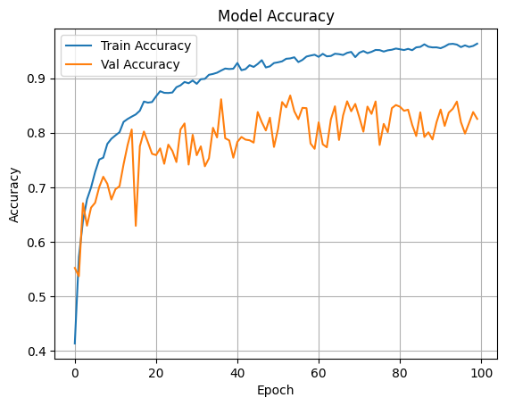
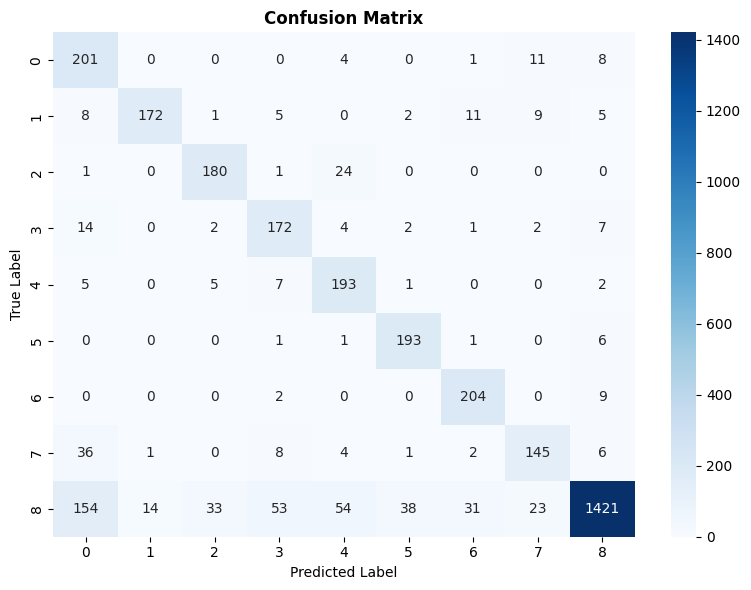
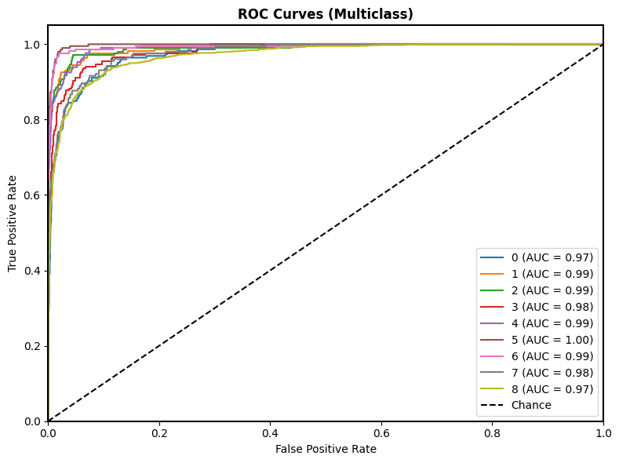
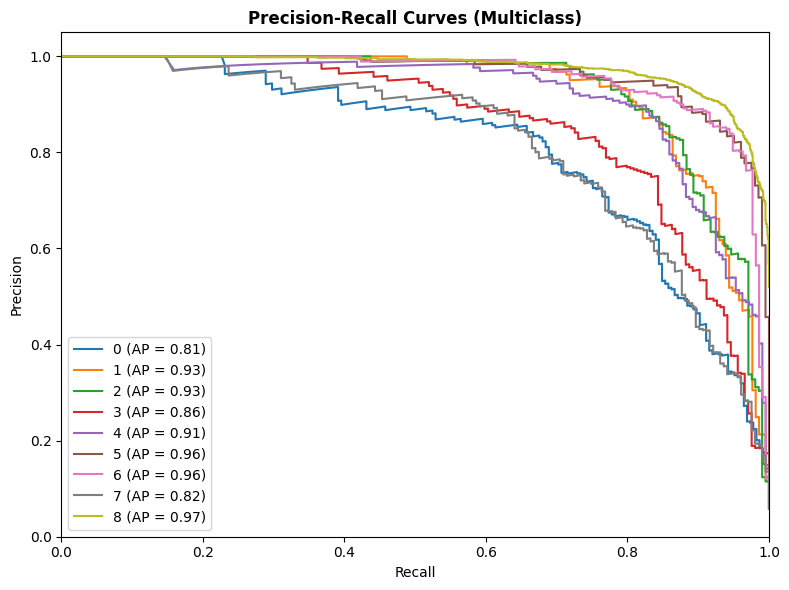

# Weed Detection

## [Dataset](https://github.com/AlexOlsen/DeepWeeds/tree/master)

* **Dataset**: DeepWeeds – 17,509 RGB images (256×256 px) across **9 classes**
* **Classes**: Chinee Apple, Lantana, Parkinsonia, Parthenium, Prickly Pear, Rubber Vine, Siam Weed, Snake Weed, Negative
* **Split**: Train 60%, Validation 20%, Test 20% (stratified)

## Preprocessing & Augmentation

* **Image size**: 224×224×3
* **Preprocessing**: `tf.keras.applications.mobilenet_v2.preprocess_input`
* **Train augmentations**: Shear 0.2, Zoom 0.2, Horizontal flip
* **Class balancing**: Computed class weights

---

## Model Comparison

| Model               | Backbone       | Attention          | Input Size | Parameters (Trainable) | Size  | Train Acc | Val Acc | Test Acc | Folder                                     |
| ------------------- | -------------- | ------------------ | ---------- | ---------------------- | ----- | --------- | ------- | -------- | ------------------------------------------ |
| MobileNetV2 + SE    | MobileNetV2    | Squeeze-and-Excite | 224×224×3  | 3.8M (1.2M)            | 42 MB | 96.31%    | 86.81%  | 82.27%   | [mobileNetV2](./Scripts/MobileNetV2/mobileNetV2.ipynb)       |
|MobileNetV3 +SE | MobileNetV3Large | Squeeze-and-Excite | 224×224×3 | 4.7M (4.7M) | 56 MB | 94.36% | 91.55% | 92.03% |[mobileNetV3](./Scripts/mobileNetV3/Mv3.ipynb)
| EfficientNetB0 + SE | EfficientNetB3 | TBD | TBD  | TBD                    | TBD   | TBD       | TBD     | TBD      | [efficientNetB3](./Scripts/EfficientNetB0/efficientNetB0.ipynb) |
| GhostNet            | GhostNet       | None               | TBD  | TBD                    | TBD   | TBD       | TBD     | TBD      | [ghostNet](./Scripts/GhostNet/ghostNet.ipynb)             |

---

## Models

### 1. MobileNetV2 + Squeeze-and-Excite

* **Backbone**: MobileNetV2 (ImageNet pretrained, frozen base)
* **Attention**: Squeeze-and-Excite block
* **Head**: Dense(1024) → BatchNorm → Dropout(0.3) → Dense(512) → Dropout(0.3) → Dense(9, softmax)
* **Optimizer**: Adam (lr=5e-4 then 1e-4 for fine-tuning last 20 layers)
* **Batch size**: 32 | **Epochs**: 100
* **Loss**: Categorical Crossentropy

#### Performance

| Metric              | Value  |
| ------------------- | ------ |
| Training Accuracy   | 96.31% |
| Validation Accuracy | 86.81% |
| Test Accuracy       | 82.27% |
| Test Loss           | 72.63% |
| FLOPs               | 585M   |

#### Plots

| Training/Validation Accuracy & Loss | Confusion Matrix |
|---|---|
|  |  |

| ROC Curves | Precision-Recall Curves |
|---|---|
|  |  |

### 2. MobileNetV3 + Squeeze-and-Excite

* **Backbone**: MobileNetV3-Large (ImageNet pretrained, last 60 layers unfrozen)
* **Attention**: Squeeze-and-Excite block
* **Head**: Dense(1024) → BatchNorm → Dropout(0.4) → Dense(512) → BatchNorm → Dropout(0.3) → Dense(9, softmax)
* **Optimizer**: Adam (lr=1e-4)
* **Batch size**: 32 | **Epochs**: 20 (early stopped)
* **Loss**: Categorical Crossentropy

#### Performance

| Metric              | Value  |
| ------------------- | ------ |
| Training Accuracy   | 94.36% |
| Validation Accuracy | 91.55% |
| Test Accuracy       | 92.03% |
| Test Loss           | 29.15% |
| Parameters          | 4.7M   |

#### Plots

| Training/Validation Accuracy & Loss | Confusion Matrix |
|---|---|
|  |  |

| ROC Curves | Precision-Recall Curves |
|---|---|
|  |  |

---
### 3. EfficientNetB0 + Squeeze-and-Excite

*(Pending Training)*

#### Performance (TBD)

| Metric              | Value |
| ------------------- | ----- |
| Training Accuracy   | TBD   |
| Validation Accuracy | TBD   |
| Test Accuracy       | TBD   |

#### Plots

| Training/Validation Accuracy & Loss | Confusion Matrix |
|---|---|
|  |  |

| ROC Curves | Precision-Recall Curves |
|---|---|
|  |  |

---

### 4. GhostNet

*(Pending Training)*

#### Performance (TBD)

| Metric              | Value |
| ------------------- | ----- |
| Training Accuracy   | TBD   |
| Validation Accuracy | TBD   |
| Test Accuracy       | TBD   |

#### Plots

| Training/Validation Accuracy & Loss | Confusion Matrix |
|---|---|
|  |  |

| ROC Curves | Precision-Recall Curves |
|---|---|
|  |  |

---

## Saved Models

* MobileNetV2 + SE: `models/mobileNetV2/mobileNetV2.h5`
* MobileNetV3 + SE: `Models/MobileNetV3/mobilenetv3_large_model.keras` 
* EfficientNetB0 + SE: `models/efficientNetB3/efficientNetB0.h5` *(TBD)*
* GhostNet: `models/ghostNet/ghostNet.h5` *(TBD)*

---
